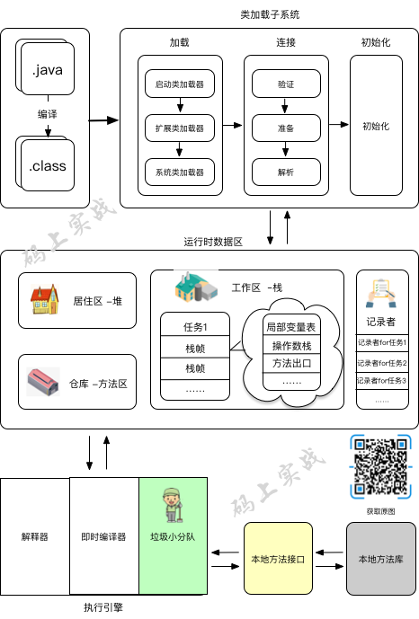
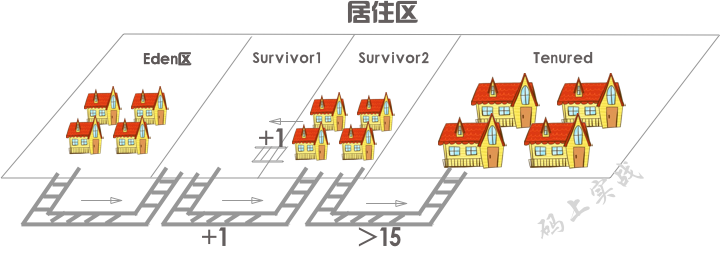
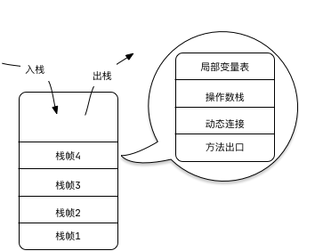
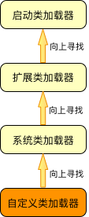
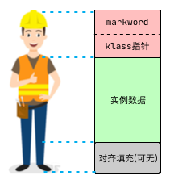
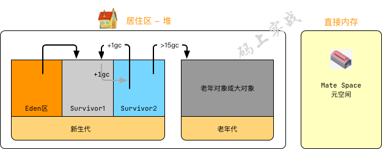

小强是一个工作3年有余的开发工程师，从他的发量你就可以知道，小强资历还尚浅。

图

 最近公司没什么事，他也开始无聊起来了。这天下午，同事们在激烈的讨论这业务，但它没有参与，于是他决定学习些什么知识，无聊的翻着各个网页，发现JVM是各位大神们推荐过的知识，于是决定好好看一看。

5分钟过后……

小强感到这知识有些枯燥乏味，怪不得是大神们能看的！（哈哈） ，又看了几分钟，小强倦意袭来，揉了揉睡眼惺忪的眼睛。

然而就在这一刻，他发现周围同事激烈讨论的声音听不到了，安静到了极致。

## 1. 入界

小强努力的睁开眼睛，才发现自己竟然身处一个白茫茫的空间中，吓得一跳，心想我这是怎么了，穿越了？但穿越也得穿越到一个人间如画，美女如云的地方啊……，这境地……

突然前方走来一个白胡子老头，小强正想开口，老头捷足先登：你好，我是这个JVM世界的缔造者，你可以叫我 “HotSpot”，不过这无所谓，因为我所创造的这个世界，是按照 “JVM规范” 来完成的。我正在休息时，发现来了一位客人，原来是你。

小强：我是想问……

老头： 不用问，我知道，你是想了解一下我创造的这个世界吧！跟我来吧。

这老头，我还没说话，这就结束了！好吧，跟你看看且说。

老头边走边道：JVM 的世界 空间是有限的，我们坚持一个原则 : 各司其职，不留无用之人！

小强： 啊！好残酷。

老头： 不，这不是残酷，我们这个世界生来就是为客户提供服务，为客户发光发热的，每个人奉献出了自己的能力就是圆满完成任务，退出舞台是理所应当的，也是他们最好的归宿。

小强：也是，我学的编程就是这个道理啊，我怎么这么不开窍呢……

## 2. 布局

过来，带你先看看我们世界的整体组成和中心区如何布局。

先来看看我们最主要的日常工作区(运行时数据区)，为了让我们工作起来更有效率，我们将世界空间划分为这几个板块。

\- 居住区（堆

这里是人们工作外的居住区，居住区我们基于人们的年龄也进一步分出了，伊甸区，幸存者区，老年区。

\- 工作区（栈

每个任务来临时，都会在工作区单独开辟出一个地方来用于完成这个任务。

\- 记录者（程序计数器

由于我们同时能做的任务有限，所以我们需要为不同的任务划分出不同的时间片，我们在切换任务的时候，需要一个记录者，能够记录我们这个任务做到了哪里，下次回来能够继续做。

\- 仓库管理区（方法区

这里存放着工人的模板以及常用的不变的工具等。

## 3. 生与死

这里工作的人们都会经历生与死，大部分人们活不到老年，但这不重要，重要的是他为我们做出了贡献。

### 3.1 出生

老头：这里的每个人都有一个模板(类)，看到那个正在居住区休息的高个吗？他叫张三，他是根据外部客户给定的模板 “ User Class” 创造的，他可是客户最喜爱的工人了。你知道客户的这些模板(类)是如何进入的到我们的世界中的吗？

小强：这个我知道点，之前看过一点点。这个过程还是有些复杂的，客户的模板(类)是通过一个翻译工厂（编译器) 将它翻译成class 字节码，因为你们这个世界只认识字节码，然后有你们的加载系统将它们加载到这里。

加载过程中有这些阶段：

其中加载阶段是由加载器来完成的。

老头：是的，我们提供了三种工厂，启动类加载器，扩展类加载器，应用类加载器。当然客户也可以自定义加载器。

小强：他们遵循着双亲委派模型，但是我一直不太理解这个词！

老头： 这是由于你们语言翻译的问题导致，这个模式叫 “parents delegation”，知道了吧！它是指有你的父辈们来帮你完成。

小强：那双亲委派模式 有什么好处呢？

老头：

1. 具有优先级层次的关系可以避免模板(类)的重复加载

2. 安全考虑可以防止Java核心api被替换

老头：那连接过程中的三步，你知道是做什么吗？

小强：具体的我就不知道了哎……

老头笑了笑：对于客户定义的模板(类)，我们可不是来者不拒的，为了我们这个世界的安全以及能提供更好的服务，我们会对模板做一些验证及后续操作。

验证包括：格式验证，元数据验证，字节码验证，符号验证。当验证通过后，我们会为模板所依赖的东西（类变量）分配空间，最后将符号引用替换为直接引用。

老头继续道：你可能不了解什么是符号引用和直接引用！

符号引用就是在编译时，并不知道模板所依赖的其他东西，会在我们的空间中的哪个位置，只能用符号来表示。

直接引用就是 所有东西被加载到这里后会有自己的真实空间地址，然后去替换符号引用。这样运行时就能找到它们所依赖的东西了。

最后就是初始化了，这个阶段主要是对类变量初始化，是执行类构造器的过程。

小强：我怎么没看到这些模板呢？

老头：这些模板我把他们隐藏在世界的后方，大多数人是见不到的，他们统称为Klass。

小强：不对啊！你是不是搞错了？不应该叫Class吗？

老头：哈哈！我刚才说了，大多数人见不到，你就是其中之一啊！你们平时见到的Class只是对Klass的一种封装而已，真正记录模板中的具体元信息的就是Klass。这回要记住了，年轻人。

### 3.2 工人

小强： 为什么你的工人是等量差的身高呢？

老头：你的观察还是挺仔细的嘛。是的，他们确实是等量差的，想要知道为什么，要先了解这些工人有哪些部分组成。

它们头部大小是固定的，身体大小是由自己的属性数据决定的，而最后的脚部却是我来决定的，如果前面两个数据的大小没有达到 8 的倍数，那么我就会来填充，所以就是这里的填充使得他们拥有了等量的身高差（内存对齐）。

我是基于两点原因来这个缔造他们的：

1. 平台原因：不是所有的硬件平台都能访问任意地址上的任意数据的；某些硬件平台只能在某些地址处取某些特定类型的数据，否则抛出硬件异常。

2. 性能原因：中央大脑(CPU)访问内存是有内存访问粒度的，就是每次访问内存的长度是固定的，如果不这样做，那么中央大脑起需要访问两次内存，而对齐后只需要一次。

小强：嗯，明白了！那能给我说说这些工人在居住区为什么要不断的搬迁呢？

### 3.3 成长

老头：经过长时间的观察，我发现每个工人的生命长短是不一样的。所以我把居住区分为新生代，老年代，然后让他们合理的搬迁，这样能有效的利用空间而且让垃圾小分队工作更有效率。

工人诞生后会分配到Eden区，当Eden区人员快满时，垃圾小分队会来清扫，清扫后如果工人还活着，那么他们将搬迁至Survivor区中的其中一个，当这个Survivor快满时，垃圾小分队会将还活着的工人搬迁至另一个Survivor区中，就这样重复着，每经历一次垃圾小分队的清扫，活着的工人就会长大一岁，直到工人的年龄达到15岁，到达后会将他们搬迁至老年代生活的地方。但也有例外，如果某个工人吃的太胖，新生代容不下他，那么他将直接去老年代住下。当老年代快住满时，将会有垃圾大扫除(full gc)。

小强：原来如此啊！从此我再也不是只知道堆区栈区的菜鸟啦！哈哈哈哈……

老头：小伙子，不要高兴太早！你到目前为止所了解的仍是九牛一毛。

### 3.4 死亡证明

小强：如何确定工人是否到达生命的尽头呢？

第一种：引用计数法

给每个工人添加一个引用计数器，就是只要有人需要这个工人帮忙，那么就给这个工人的计数加1，反之，别人不再需要这个工人的帮忙，那么计数就减1，知道这个计数为0，那么表示这个工人生命到了尽头。

但这种方法有个问题：如何A工人和B工人相互需要帮忙，但没有任何其他工人或任务需要他们两个，那么他们两个会永远活下。

所以这种方法我们不会采取的。

第二种：可达性分析法

我们找出被称为“GC roots”的工人作为起点，依次寻找他们工作中依赖的工人，这就可以知道哪些工人是没有必要在存在下去了。

小强：我怎么知道哪些是GC roots 工人呢？

老头：

1. 工作区（栈）中的需要用到的工人

2. 仓库（方法区）中模板（类）本身需要的工人（静态，常量）

3. 世界后方（native方法）需要的工人

明白了！

## 4. 回收

老头：下面我带你去认识一下垃圾小分队的人物吧！不过在认识他们之前你最好了解一下，垃圾清除的基本方法论。

### 4.1 基本方法论

收集垃圾遵循的基本方法论有以下几种：

- 标记-清除

  首先标记出所有需要回收的工人(对象)，在标记完成后统一回收所有被标记的工人。

  但这个有两个缺点：1. 效率不高  2. 会产生许多碎片空间

- 复制

  将可用的空间一分为二，每次只使用其中一块，当快使用完时，小分队回收，然后将活着的工人搬迁至另一块。

  这虽然解决了标记-清除的效率问题，但此种方法却缩小了一半空间。

- 标记-整理

  首先标记出所有需要回收的工人(对象)，然后将存活的工人移动到空间的一端，然后清理掉边界以外的工人。

小强笑了笑：原来是这三种算法啊！我知道！

老头：既然知道，那跟我来认识一下垃圾清扫队的人吧！

### 4.2 主要成员

垃圾清扫队有好几个小队组成，客户喜欢哪个小队可以指定让谁来工作，他们各个队伍的清扫方式各不相同也各有优劣。

我给你介绍一下两个主要成员吧，CMS，G1两个小队出列。

CMS：到，我们是CMS分队，全称叫“Concurrent Mark Sweep”，顾名思义，我们是采用标记清除算法的并发小分队，我们以获取最短回收停顿时间为目标。

小强：那你说说你们是如何工作的？

CMS：我们主要分四个步骤工作，1. 初始标记 2.并发标记 3.重新标记 4.并发清除

小强：算啦，这么多步骤太需要时间来了解了，我现在知道你的优点了，那你的缺点有什么呢？

CMS：这怎么还带揭人伤疤的……

老头这时严肃的咳嗽了两声，其意CMS立马捕获到了，委屈的说：

我有三个缺点：

1. 占用过多这个时间的资源，当资源不是很充足时

2. 无法处理浮动垃圾，我们清理的时候，工人同时也在工作，我们标记后，正好有些工人不在需要了

3. 我们分队遵循的是“标记-清除”算法，所以会产生大量碎片空间，导致世界大扫full gc除提前到来。

心直口快的小强来了句：原来你的问题这么严重，老头竟然没把你们小分队辞掉……

CMS：你…… 想当年我们分队可是红极一时的……

那么我猜G1是不是可以弥补CMS的不足呢？

G1: 说实话，我们分队的目标就是替换CMS分队…… （JDK14 CMS正式落下帷幕）

小强不怀好意的笑了起来，哈哈……，CMS翻着白眼躲到一旁的角落暗自伤感去了。

小强：那G1说说你的能耐吧！

G1: 我们队是基于标记整理算法的，因此不会产生大量碎片空间

我们同时引入了分区的思路，弱化了分代的概念

我们的停顿时间是可控的，可避免雪崩现象

我们也能充分利用客户给我们的资源，减少停顿时间。

这是我们队的优势，接下来我给你详细介绍下我们队的情况……

小强：好的！你继续……

## 回归

就在小强听的兴趣浓浓时，天空中突然出现一只巨大无比的手向他袭来，小强躲闪不开，啊……

小强捂着自己的头，有点恍惚，抬头一看，擦，技术总监……你怎么也在这？

总监：我不在这我在哪？在家睡大觉吗！

这时小强才回过神来，原来自己还在办公室，大事不妙啊！

总监：小强，回家多爽，明天就不用来了吧！

小强一慌，脑袋灵机一动：总监，知道我刚才在做什么吗？那可不是在睡觉，我有一个故事你且听听再做决定。

吧啦吧啦……