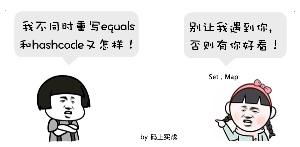

---
title: 不同时重写equals和hashCode又怎样！
tags: [Java,equals,hashCode]
date: 2019-04-05 10:14:15
--- 

可能一问到equals和hashCode相关的问题，就会有人讲他们的自反性，对称性，一致性，传递性等几条约定了，
此时我不得不佩服，这么多约定竟然都能记得，但我不知道你是不是真的理解呢。

## 我不同时重写又能如何呢？



我只能说只要你不碰到这几个主，你也没什么事的！

- 为什么不能遇到它们几个呢？

    因为它们几个会用到hashCode方法。

- 他们用hashCode方法来干嘛？
    
    hashCode方法是根据对象的地址生成的一个int整数，默认它和地址一一对应的，如果不重写，那么只有对象地址一样的情况下，哈希值才相等。
    
    equals默认用来比较地址是否相同，但当集合中元素增多时，再使用equals判断，效率是比较低的；而哈希值是可以快速定位到指定的元素的，
    所以默认Java就使用哈希值来比较定位，因此有了Object.hashCode的约定。
    
    Set怎么实现存储不重复的元素的？HashMap怎么判断相同的key的？有兴趣可去深入了解一下。
    

## 例子

小王在「堆」中有两套房产，这两套房产位于不同的地址。现在我想要判断这两套房子是否是同一个主人？


于是我去问Object，而Object告诉我这两套房产不是一个人的！

我：为什么呢？

Object: equals告诉我两套房子离了十万八千里，在不同的地方（地址），当然不是同一个人了。

我：这逻辑……（不符合我们常规的认知啊）

既然这样，那我只能重写equals了！

```java
//注意：这是伪代码，省略了很多
//重写equals，认为身份证相同就是同一个人
@Override
public boolean equals(Object obj) {
   return this.idCard == obj.idCard;
}
```

哈哈，好啦，现在equals终于知道这两个房子是同一人的啦！

然而在房产管理局（HashMap）我得到一个消息：小王只要一套房产！

WTF！我白干了！

房产管理局（HashMap）: 不信你看！

```java
    HashMap<Object, Integer> roomManager = new HashMap<>();

    public void count(){
        User u1 = new User("小王", "34128");
        countRoom(u1);
        User u2 = new User("小王", "34128");
        countRoom(u2);
    }
    public void countRoom(User user){
        boolean exist = roomManager.containsKey(user);
        if (exist) {
            Integer num = roomManager.get(user);
            roomManager.put(user, num++);
        }else {
            roomManager.put(user, 1);
        }
    }
```

遇到你真是倒霉了，原来房产管理局（HashMap）使用了hashCode来计算的！想要正确的统计小王的房产只能重写hashCode方法了。

```java
    @Override
    public int hashCode() {
        int result = name != null ? name.hashCode() : 0;
        result = 31 * result + (idCard != null ? idCard.hashCode() : 0);
        return result;
    }
```

此时，他们统计终于对了！！！

## 总结
除非你能保证你重写equals的类不被Set,Map使用，否则你就必须同时重写equals和hashCode。

你能保证吗？如果不想同时重写，你可以这样：

```java
/**
 * 1.此类应用于Set,Map时，需要使用者重写hashCode，违规者后果自负
 * 2.本类不能作为第三方类库供其他项目使用 
 * @author flyhero
 * @date 2019-04-03 6:14 PM
 */
public class User {}
```
信不信这样写，老大看到后，就say goodbye了！

### 疑问

采用这种约定，可控性比较差，全靠开发者的素质。为什么不采取一种强制同时重写的机制呢？

## 如何重写equals与hashCode

我就不写出常说的那些约定性质了，写了也记不住。说说如何避免违反这些约定：

### 重写equals

1. 通过==判断是否是同一个引用
2. 通过instanceof判断是否是相同类型
3. 把参数转为正确的类型
4. 对比双方各个属性值是否相同

如：
```java
    @Override
    public boolean equals(Object obj) {
        if (this == obj) {
            return true;
        }
        if (!(obj instanceof User)) {
            return false;
        }
        User user = (User) obj;
        return this.name.equals(user.name)
                && this.idCard.equals(user.idCard);
    }
```

### 重写hashCode

hashCode方法应该为“不相等的对象产生不相等的哈希值”

一般计算是根据你equals中用来比较的属性的hashCode组合计算的，不过目前JDK和一些类库已经给我提供了很好的重写方式，我们可不必去深究其中算法。

- 方式一
    ```java
    @Override
    public int hashCode() {
        return Objects.hash(name, idCard);
    }
    ```
    使用了JDK自带Objects提供的静态方法。
    
- 方式二
    ```java
    @EqualsAndHashCode
    public class User {}
    ```
    使用了lombok类库，直接在类上注解即可。