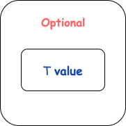

为什么我要使用Optional ？大家都会说为了预防空指针！那么如何预防的空指针呢？

很多文章上来就会列举出一堆Optional的API，太没劲了，相信大家都是会看API的开发者，不需要别人列出来。


那么我就不详细介绍API了，我从开发中的两个角度来说说：

1. 作为接口提供者，如何提供一个更好的接口
2. 作为接口调用者，如何使用合理的Optional


## 理解Optional

设计目的：**我们的目的是为方法的返回类型提供一种有限的机制，其中需要一种明确的方式来表示“无结果”，并且对于这样的方法使用null绝对可能导致错误。**

Optional 就是一个可以包含NULL值的容器，或者你直接叫做一个包装类，只包装了一个属性，这个属性的值可有可无。

- 它是box类型，保持对另一个对象的引用
- 是不可变的，不可序列化的
- 没有公共构造函数
- 只能是present 或absent
- 通过of(), ofNullable(), empty() 静态方法创建


如图：





## 身为接口提供者

我有一个方法定义如下：

```java
/**
	 * 获取用户
	 * @param id 唯一id
	 * @return 用户 可能为null,代表不存在
	 */
	public User getUser(Long id) {
		if (null != id) {
			return new User();
		}
		return null;
	}
```

尽管我已经在方法注释中说明返回的User可能为空，可我依然不敢保证其他开发成员都会进行 ` if (user == null) ` 判断，当没有这一步时，那么接下来就是大家最常见的`NullPointerException` .

此时，调用者会不会内心：`MD,不存在也不说一下！`。 

提供者：（捂脸）冤枉啊！你自己不看方法注释，还怪我……

你们说这个时候是不是该Optional上场了？

```java
	public Optional<User> getUser(Long id) {
		if (null != id) {
			return Optional.of(new User());
		}
		return Optional.empty();
	}
```

你们看！现在我已经明确的告诉了调用者，我返回的用户对象是可能存在也可能不存在，你要注意两者的不同处理。

**此时，我仅仅改变一个返回值，就能很大程度上帮助调用者避免NPE的问题。**


## 身为调用者

提供者返回的类型为Optional，那么就是说返回的对象可能为null,那么我要分别判断存在和不存在该如何处理了，如下：

```java
public void test(){
  Optional<User> userOp = getUser(110L);
  if (userOp.isPresent()){
    User user = userOp.get();
    // TODO 
  }else{
    // TODO 
  }
}
```


如果我现在只想对不为空的情况处理：

```java
userOp.isPresent(user -> log.info(user));
```

如果现在我想获取用户住址中的国家：

```java
userOp.map(User::getAddress)
  .map(Address::getCountry);
```

如果用户不存在或地址不存在，我需要抛出异常：

```java
userOp.map(User::getAddress)
  .map(Address::getCountry)
  .orElseThrow(NotExistException::new);
```

如果想要设置默认值：

```java
userOp.map(User::getAddress)
  .map(Address::getCountry)
  .orElse("默认值");
```

为什么使用map方法不会出现NPE呢？因为map遇到不存在的值就会返回一个不含任何值的Optional对象，直到走到elase方法，等待使用者的处理。

```java
public<U> Optional<U> map(Function<? super T, ? extends U> mapper) {
        if (!isPresent())
            return empty();
        else {
            return Optional.ofNullable(mapper.apply(value));
        }
    }
```


经过上面的学习，我就不再担心出现NPE啦！赶快让大家用起来吧。