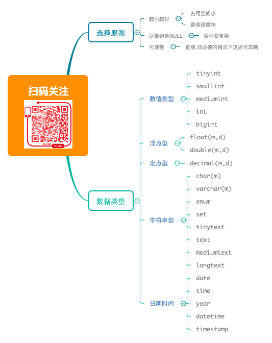

为什么选择合适的数据类型很重要？因为数据类型会影响存储空间的开销，也会影响数据的查询效率，可以说这是你优化数据库的第一步要做的事情。

## 疑问 

本文的前提环境是：MySQL 5.7 , UTF-8 Unicode

### char与varchar的区别和选择？

- CHAR是固定长度，长度范围为0-255字符，存储时，如果字符数没有达到定义的位数，会在后面用空格补全存入数据库中，比指定长度大的值将被截短。

- VARCHAR是变长长度，长度范围为0-21845(utf8)或16383(utf8mb4)字符，存储时，如果字符没有达到定义的位数，也不会在后面补空格，当然还有一或两个字节来描述该字节长度

### varchar(10) 括号中的数字代表 字节 还是 字符 ？

代表的是字符，无论英文或中文 都可以存储10个字符。

### int(5) 括号中的数字代表 什么 ？

数字5并不是代表存储的长度，int型的长度是4字节固定的，括号里的数字仅仅代表最小显示的宽度。

- 那我们设置它的意义何在呢？ 

    其实当我们长度超过5的时候它是没用的，和没有设置一样，当长度没有超过5时，并且设置了zerofill(填充零)，它会在不足的从左侧填充零，假如插入了数字 22 ，那么显示的是 00022 （navicat不显示，可在cmd中查看）。
所以你指定的数字和它的大小及存储的空间没有关系。

### int 括号中的数字为什么默认11或10 ？

 int有符号数最小值:

`-2 1 4 7 4 8 3 6 4  8`  总共11位
  
 `2 1 4 7 4 8 3 6 4  7`   总共10位

所以你懂得…… 其它的整数类型以此类推。

### 现在为什么很少使用CHAR ？

 因为我们使用的是 InnoDB存储引擎，内部的行存储格式没有区分固定长度和可变长度列（所有数据行都使用指向数据列值的头指针），因此在本质上，使用固定长度的CHAR列不一定比使用可变长度VARCHAR列简单。因而，主要的性能因素是数据行使用的存储总量。由于CHAR平均占用的空间多于VARCHAR，因此使用VARCHAR来最小化需要处理的数据行的存储总量和磁盘I/O是比较好的。

Value &emsp; |	CHAR(4)&emsp;| 实际存储| VARCHAR(4)&emsp;| 实际存储
---|---|---|---|---
''          |	' ' |	4 bytes | '' 	|   1 bytes
'ab'        |'ab  ' |	4 bytes |'ab'   |	3 bytes
'abcd'      |'abcd' |	4 bytes |'abcd' |	5 bytes
'abcdef'    |'abcd' | 	4 bytes |'abcd' |	5 bytes

可以用上表来表示，当定义char时，不管你存入多少字符，都会占用到你定义的字符数，而用varchar时，则和你输入的字符数有关，会多一到两个字节来记录字节长度，当数据位占用的字节数小于255时，用1个字节来记录长度，数据位占用字节数大于255时，用2个字节来记录长度，还有一位来记录是否为nul值

我平时会把这篇总结当做一个字典，每次设计数据库时忘记了会拿出来看下。

MySQL支持的数据类型主要分为3类：
- 数值类型
- 字符串类型
- 日期时间类型

## 数值类型
### 整数型

> 1byte = 8bit  关于位的计算可参考我的另一篇文章《位运算》

类型&emsp;&emsp; | 存储(byte)|符号|最小值(公式)|最大值(公式) 
---|---|---|---|---
tinyint | 1|有|-128 (-27)|127 (27-1)
   |   |无 |0 | 255 (28-1)
smallint|2|有|-32768 (-215)|32767 (215-1)
 | |无|0|65535 (216-1)
mediuint|3|有|-8388608 (-223)|8388607 (223-1)
 | |无|0|16777251 (224)
int|4|有|-2147483648 (-231)|2147483647 (231-1)
 | |无|0|4294967295 (232-1)
bigint|8|有|-9223372036854775808 (-263)|9223372036854775807 (263-1)
 | |无|0|18446744073709551615 (264-1)

### 定点型

使用方式：即`DECIMAL(M,D)`

- M 表示十进制数字**总的个数**
- D 表示小数点后面数字的位数
- M的默认取值为10，D默认取值为0。如果创建表时，某字段定义为decimal类型不带任何参数，等同于decimal(10,0)。带一个参数时，D取默认值。

M的取值范围为1~65，取0时会被设为默认值，超出范围会报错。
D的取值范围为0~30，而且必须<=M，超出范围会报错。

所以，很显然，当M=65，D=0时，可以取得最大和最小值。

#### 举例

例如: DECIMAL(5,2)   
范围: -999.99 到 999.99

如果存储时，整数部分超出了范围（如上面的例子中，添加数值为1000.01），就会报错，不允许存这样的值。

如果存储时，小数点部分若超出范围，就分以下情况：

1. 若四舍五入后，整数部分没有超出范围，则只警告，但能成功操作并四舍五入删除多余的小数位后保存。如999.994实际被保存为999.99。
2. 若四舍五入后，整数部分超出范围，则报错，并拒绝处理。如999.995和-999.995都会报错。

### 浮点型

MySQL数据类型 	|含义
---|---
float(m,d) |	单精度浮点型    8位精度(4字节)     m总个数，d小数位
double(m,d) |	双精度浮点型    16位精度(8字节)    m总个数，d小数位

浮点数是用来表示实数的一种方法，它用 M(尾数) * B( 基数)的E(指数）次方来表示实数，相对于定点数来说，在长度一定的情况下，具有表示数据范围大的特点,但同时也存在误差问题。如果希望保证值比较准确，推荐使用定点数数据类型。

#### 举例

例如: float(7,4)
范围: -999.9999 到 999.9999

MySQL保存值时进行四舍五入，因此如果在FLOAT(7,4)列内插入999.00009，近似结果是999.0001。

float和double中的M和D的取值默认都为0，即除了最大最小值，不限制位数。允许的值理论上是-1.7976931348623157E+308~-2.2250738585072014E-308、0和2.2250738585072014E-308~1.7976931348623157E+308。

M、D范围:

 - M取值范围为0~255。FLOAT只保证6位有效数字的准确性，所以FLOAT(M,D)中，M<=6时，数字通常是准确的。如果M和D都有明确定义，其超出范围后的处理同decimal。
 - D取值范围为0~30，同时必须<=M。double只保证16位有效数字的准确性，所以DOUBLE(M,D)中，M<=16时，数字通常是准确的。如果M和D都有明确定义，其超出范围后的处理同decimal。

FLOAT和DOUBLE中，若M的定义分别超出7和17，则多出的有效数字部分，取值是不定的，通常数值上会发生错误。因为浮点数是不准确的，所以我们要避免使用“=”来判断两个数是否相等。

## 字符串型

字符串类型指CHAR、VARCHAR、BINARY、VARBINARY、BLOB、TEXT、ENUM和SET。

类型名称&emsp;&emsp; |	说明 |	存储需求
---|---|---
CHAR(M) |	固定长度的非二进制字符串 |	M字符，1<=M<=255
VARCHAR(M) |	变长的非二进制字符串 |	M字符，1<=M<=21845(utf8)或16383(utf8mb4)，最大上线65535字节
ENUM |	枚举类型，只能有一个枚举字符串值 |	1或2个字节，取决于枚举值的数目(最大值是65535)
SET |	一个设置，字符串对象可以有零个或多个SET成员 |	1，2，3，4或8个字节，取决于集合成员的数量（最多64个成员）
TINYTEXT |	非常小的非二进制字符串 |	L+1个字节，这里L<28
TEXT |	小的非二进制字符串 |	L+2个字节，这里L<216
MEDIUMTEXT |	中等大小的非二进制字符串 |	L+3个字节，这里L<224
LONGTEXT |	大的非二进制字符串 |	L+4个字节，这里L<232

## 日期和时间型

MySQL数据类型 |字节长度|	含义（格式）|范围
---|---|---|---
date |3	|日期 YYYY-MM-DD|'1000-01-01'到 '9999-12-31'
time |3 |	时间  HH:MM:SS|'-838:59:59'到'838:59:59'
year| 1	|年YYYY|1901到2155
datetime|8 |	日期时间 YYYY-MM-DD HH:MM:SS|'1000-01-01 00:00:00'到'9999-12-31 23:59:59'
timestamp| 4	|自动存储记录修改时间YYYY-MM-DD HH:MM:SS|'1970-01-01 00:00:01' UTC 到'2038-01-19 03:14:07' UTC

### 日期类型的选择

- 如果你的应用不牵涉到时区/国际业务，那么你最好选择datetime/timestamp，可读性高，统计方便。
- 如果你的应用牵涉的时区或国际业务，你们建议你使用bigint/timestamp来存储时间戳，这样没有时区的困扰，但bigint可读性差。
- 如果你认为你的应用能够运行到2037年以后，那么别用timestamp。

## 选择合适的类型

这里指的是数据列的数据类型，在选择合适的数据类型时，我们应满足以下条件:

- 尽量选择小，简单的数据类型。
- 保持可读性。
- 尽量避免Null

## 参考

https://dev.mysql.com/doc/refman/5.7/en/precision-math-decimal-characteristics.html

https://dev.mysql.com/doc/refman/5.7/en/data-types.html

https://www.edureka.co/blog/mysql-data-types/#String%20Types

https://stackoverflow.com/questions/25300821/difference-between-varchar-and-text-in-mysql

https://blog.csdn.net/vkingnew/article/details/82687471